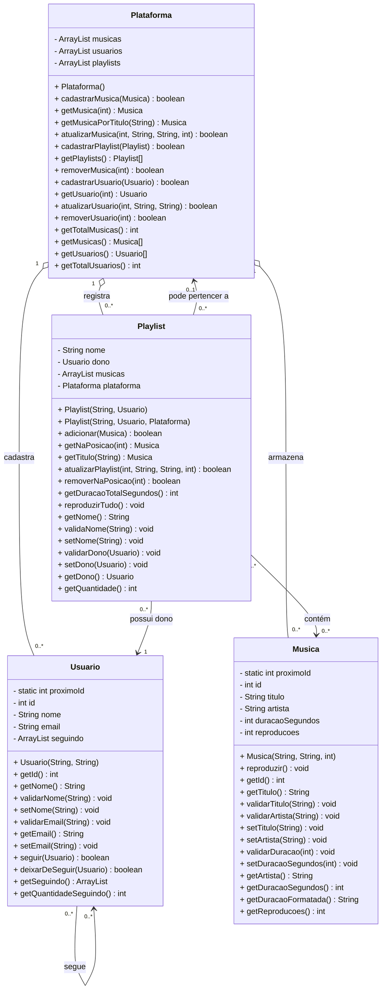

# Diagrama de Classes - Sonora

## Revisão das relações
- `Plataforma` é um agregador de músicas, usuários e playlists.
- `Usuario` tem associação reflexiva: um usuário pode seguir outros usuários.
- `Playlist` possui um dono (`Usuario`) e uma coleção de músicas.
- A referência a `Plataforma` em `Playlist` é opcional, não composição obrigatória.
- Não há `App` no diagrama, conforme solicitado.
